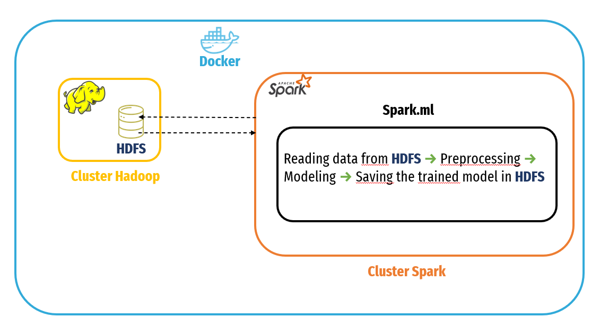

---
| title      | Predictive Analytics with Spark MLlib (GBTClassifier) on Hadoop/Spark Cluster                                    |
| shortTitle | Spark MLlib Project                                                                                              |
| intro      | A project for building and testing a Gradient Boosted Trees (GBT) model with Spark MLlib on a Dockerized Hadoop/Spark cluster using a survey dataset. |
| type       | project                                                                                                         |
| topics     | big-data, spark, hadoop, machine-learning, scala                                                               |
---


## Introduction

This project demonstrates how to **analyze data and predict trends** using **Apache Spark MLlib** with a **GBTClassifier**.  
The project is deployed on a **Hadoop/Spark cluster** created with **Docker**.  

You will:  
- Set up a Hadoop and Spark cluster with Docker.  
- Load and preprocess a dataset (`survey.csv`) stored in **HDFS**.  
- Train a predictive model using Spark MLlib’s **GBTClassifier**.  
- Save the trained model in HDFS.  
- Test the saved model on new data.  

**Prerequisites:**  
- Basic knowledge of **Scala** and **Spark MLlib**.  
- Familiarity with Docker and Hadoop/Spark clusters.  
- Docker installed on your machine (Linux/Windows/Mac).  

---

## Step 1: Project Architecture

  

  *Figure 1: Architecture of the Hadoop + Spark cluster for training and testing the model.*  

---

## Step 2: Dataset Description

The dataset used is **survey.csv**, a collection of responses to a survey on **mental health in the workplace**.

It includes:

* **Demographics**:
  * `Timestamp` → date of the response  
  * `Age` → participant’s age  
  * `Gender` → self-declared gender  
  * `Country`, `state` → country and state of residence  

* **Professional Information**:
  * `self_employed` → self-employed status  
  * `no_employees` → company size  
  * `remote_work` → works remotely  
  * `tech_company` → whether the company is a tech company  

* **Mental Health Related Questions**:
  * `family_history` → family history of mental illness  
  * `treatment` → has received treatment before  
  * `work_interfere` → impact on work  
  * `benefits`, `care_options`, `wellness_program`, `seek_help`, `anonymity` → perception of resources provided  
  * `leave` → ease of requesting sick leave  
  * `mental_health_consequence`, `phys_health_consequence` → perceived consequences  
  * `coworkers`, `supervisor` → perceived support at work  
  * `mental_health_interview`, `phys_health_interview` → willingness to discuss in interview  
  * `mental_vs_physical` → comparison between mental vs physical health  
  * `obs_consequence` → observed consequences  

* **Target Variable (potential label)**:
  * `treatment` (Yes/No) → used to predict if a person is likely to seek treatment.  

**Remark:** In the code, only a subset of columns is selected for modeling:

```scala
val selectedColumns = Seq(
  "Age", "Gender", "self_employed", "family_history", "work_interfere", 
  "no_employees", "remote_work", "tech_company", "benefits", "seek_help", 
  "anonymity", "leave", "mental_health_consequence", "phys_health_consequence", 
  "treatment"
)
``` 

---

## Step 3: Setup Hadoop Cluster

### 3.1 Pull the image
```bash
docker pull liliasfaxi/spark-hadoop:hv-2.7.2
```

### 3.2 Create the Docker network
```bash
docker network create hadoop-spark-net
```

### 3.3 Start Hadoop Master
```bash
docker run -itd --net=hadoop-spark-net \
  -p 50070:50070 -p 8088:8088 -p 7077:7077 -p 16010:16010 \
  --name hadoop-master --hostname hadoop-master \
  liliasfaxi/spark-hadoop:hv-2.7.2
```

### 3.4 Start Hadoop Slaves
```bash
# Slave 1
docker run -itd --net=hadoop-spark-net \
  -p 8040:8042 \
  --name hadoop-slave1 --hostname hadoop-slave1 \
  liliasfaxi/spark-hadoop:hv-2.7.2

# Slave 2
docker run -itd --net=hadoop-spark-net \
  -p 8041:8042 \
  --name hadoop-slave2 --hostname hadoop-slave2 \
  liliasfaxi/spark-hadoop:hv-2.7.2
```

### 3.5 Start Hadoop services
```bash
docker exec -it hadoop-master bash
./start-hadoop.sh
hadoop fs -ls /
```

## Step 4: Setup Spark Cluster

### 4.1 Start Spark Master
```bash
docker run -itd \
  --net=hadoop-spark-net \
  -p 8080:8080 -p 7077:7077 \
  --name spark-master \
  --hostname spark-master \
  liliasfaxi/spark-hadoop:hv-2.7.2
```

### 4.2 Start Spark Workers
```bash
# Worker 1
docker run -itd \
  --net=hadoop-spark-net \
  -p 8081:8081 \
  --name spark-worker1 --hostname spark-worker1 \
  liliasfaxi/spark-hadoop:hv-2.7.2

# Worker 2
docker run -itd \
  --net=hadoop-spark-net \
  -p 8082:8081 \
  --name spark-worker2 --hostname spark-worker2 \
  liliasfaxi/spark-hadoop:hv-2.7.2
```

### 4.3 Start Spark services
```bash
docker exec -it spark-master bash
/usr/local/spark/sbin/start-all.sh
```

## Step 5: Copy Hadoop Configuration to Spark

For Spark to access HDFS correctly, copy the Hadoop configuration file:
```bash
docker cp ./core-site.xml spark-master:/spark/conf/core-site.xml
```
## Step 6: Load Data into HDFS

Copy survey.csv into the Hadoop container and load it to HDFS:
```bash
docker cp survey.csv hadoop-master:/root/
docker exec -it hadoop-master bash
hadoop fs -mkdir /data
hadoop fs -put survey.csv /data/
hadoop fs -ls /data/
```
## Step 7: Run Training and Testing Applications

### 7.1 Open Spark Shell
```bash
docker exec -it spark-master /spark/bin/spark-shell \
  --master spark://spark-master:7077 \
  --driver-memory 4g --executor-memory 4g --executor-cores 2
```

### 7.2 Train the Model

Inside the Spark Shell, load the training script:
```bash
:load "app_spark_gbt_classifier.scala"
```
This will:
- Read survey.csv from HDFS.
- Preprocess the data with Spark MLlib.
- Train a GBTClassifier model.
- Save the trained model into HDFS.

### 7.3 Test the Model

To test the saved model on new data:
```bash
:load "test_model_app.scala"
```
This will:
- Load the trained model from HDFS.
- Apply it to new survey data.
- Display predictions.